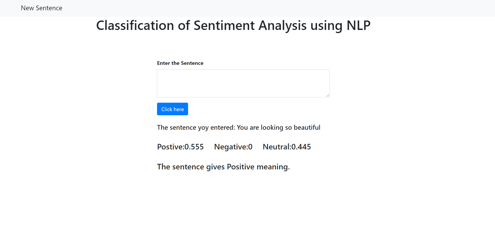

# Sentiment-Analysis-NLP

## Introduction
Sentiment analysis is the automated process of determining whether a text expresses a positive, negative, or neutral opinion about a product or topic. Sentiment is an idea or feeling that someone expresses in words. With that in mind, sentiment analysis is the process of predicting/extracting these ideas or feelings. We want to know if the sentiment of a piece of writing is positive, negative or neutral. Exactly what we mean by positive/negative sentiment depends on the problem we’re trying to solve.

## How to run
````
    $ git clone https://github.com/hunnurjirao/Sentiment-Analysis-NLP.git
    
    $ yarn install
    
    $ yarn start
````
## Results

## Try it!
https://sentiment-analysis-nlp1.herokuapp.com/
